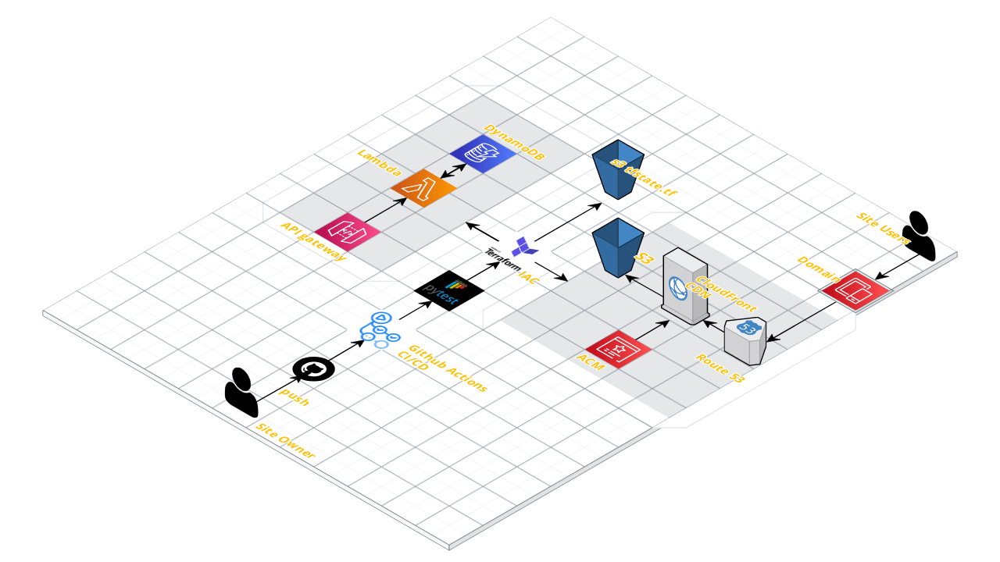

**Project Architecture**

**Project Steps**

**1. Front-End**

Created Front-end with Angular Framework

**2. Static Website**

Stored my web files in an S3 Bucket and launched it as a static website

**3. HTTPS**

Used CloudFront to enable HTTPS and caching at edge locations

**4. DNS**

Route 53 was utilized to create my domain name (https://r0gu3.me/) "Currently down because of expenses"
Attached an SSL Certificate to CloudFront for alternate names

**5. Javascript**

Leveraged angularjs for my website to use the API Gateway that is created in later steps

**6. Database**

Utilized DynamoDB to store my website view count
PROVISIONED pricing was necessary to make usage of the database essentially free
Holds a single attribute which will be updated by the Lambda function
Another table was made to store .tfstate

**7. API**

Rest API allows access to URL endpoint to accept GET and POST methods
When API URL is accessed the Lambda function is invoked, returning data from DynamoDB table
CORS Enabled ---> Which took the most time :)

**8. Python**

2 Lambda functions written using Python to get and post count into DynamoDB
Utilizes boto3 library for AWS

**9. Tests**

Tested Lambda function using PyTest in Lambda dashboard
Tested GET and POST methods directly in API Gateway dashboard

**10. Infrastructure as Code**

Terraform used as IaC method
Configured to use S3 as storage for the state file
All resources created in Terraform with the exception of S3 bucket for .tfstate, Route 53 Hosted Zone and the required SSL Certificate

**11. Source Control**

This repository created in GitHub in order to implement CI/CD

**12. CI/CD Backend**

GitHub Actions Workflow created to use Terraform apply whenever a file in the backend directory is updated
Workflow tests Lambda Function whenever there is a change to Python code and compresses the .py file into a .zip file to send into AWS

**13. CI/CD Frontend**

2nd GitHub Actions Workflow created to use Terraform apply whenever a file in the frontend directory is updated in angular and synced to S3 bucket

**14. Monitoring**

Used CloudWatch and DataDog for Monitoring API Gateway performance and Lamda Execution
